# save-care
**108 學年度「元智大學人工智慧競賽課程專題組」**

**組員: 許巧臻、劉姿岑、葉亭妤** 

**指導老師: 陳彥安**

## 設計緣起

我們的作品的出發點是希望能夠幫助到獨居老人，以便萬一發生情況，也能及時通知，減少發生遺憾的可能性。作品主體是透過 STM32F411RE的板子、 加速度計來偵測數值變化，數值會從發送端透過Wi-Fi上傳至雲端Ubidots以供監測。透過參考他人論文中的跌倒公式，根據我們的實際情況做參數調整後，判斷是否有跌倒的情形發生。若是偵測到跌倒的狀態，上傳的數值會改變，此時接收端接收到變化後LED會熄滅表示通知家人，同時電路板上的蜂鳴器會響起，當作警報器的概念，即使在不同樓層跌倒，也能透過聲音及時發現老人跌倒。若是老人跌倒仍有意識並且沒有大礙，即可自行按下電路板上的按鈕，代表老人一切平安並回報給家人，同時蜂鳴器也解除狀態。

## 執行流程

* 準備跌倒
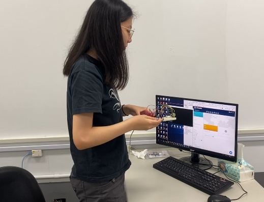

* 原先資料狀態
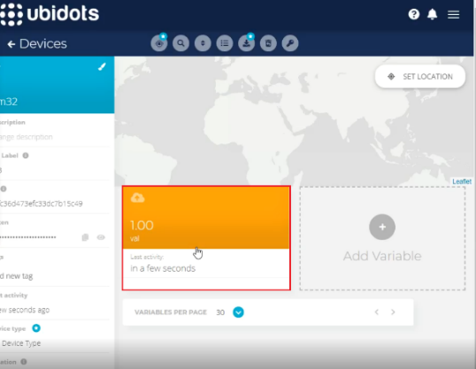

* 偵測跌倒情況(發送端)(蜂鳴器會響) 
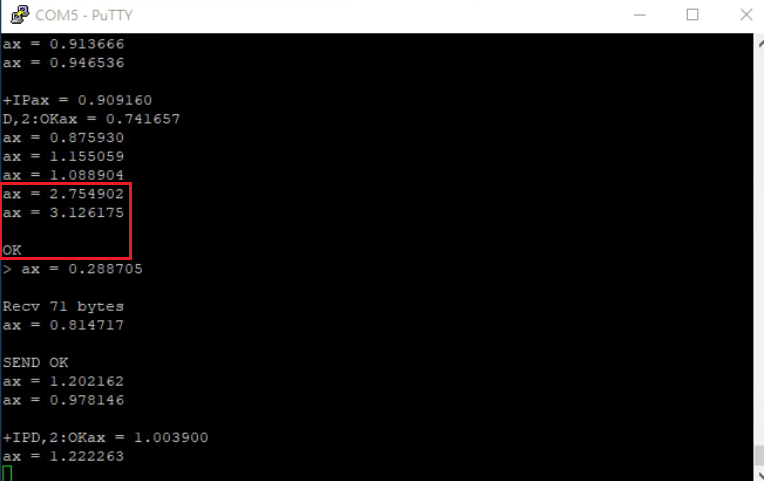
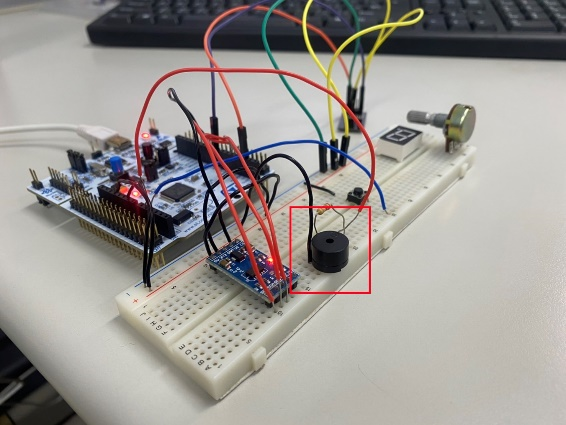

* 偵測後資料狀態(Ubidots)
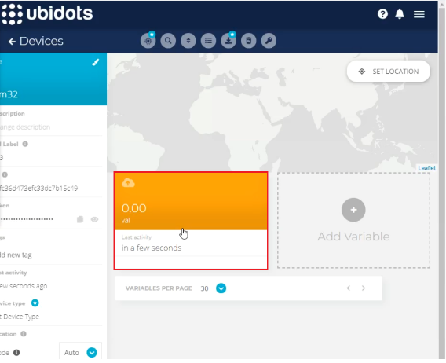

* 接收到跌倒情況(接收端)(LED暗)
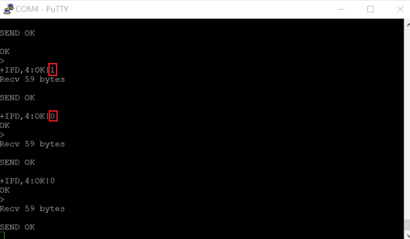
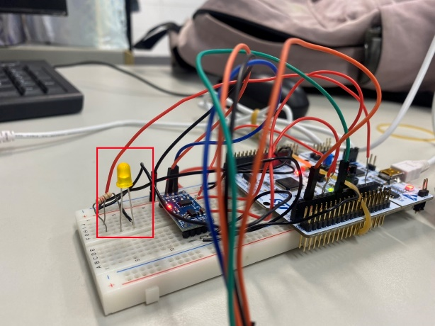

* 跌倒但還有意識沒有大礙，則按下按鈕回復正常狀態
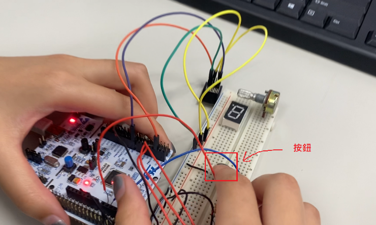

* 回復正常狀態(Ubidots)

* 回復正常狀態(接收端)
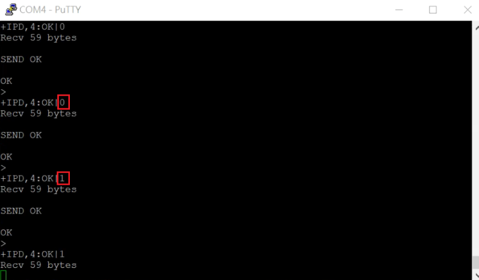

## 硬體電路示意圖

* Send端
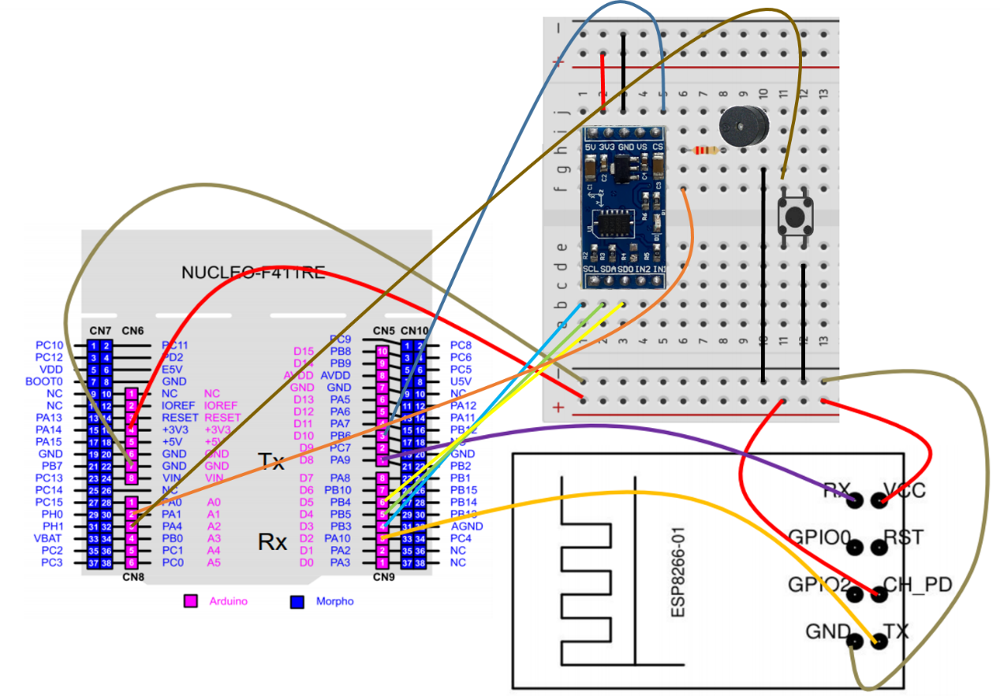

* Retrieve端
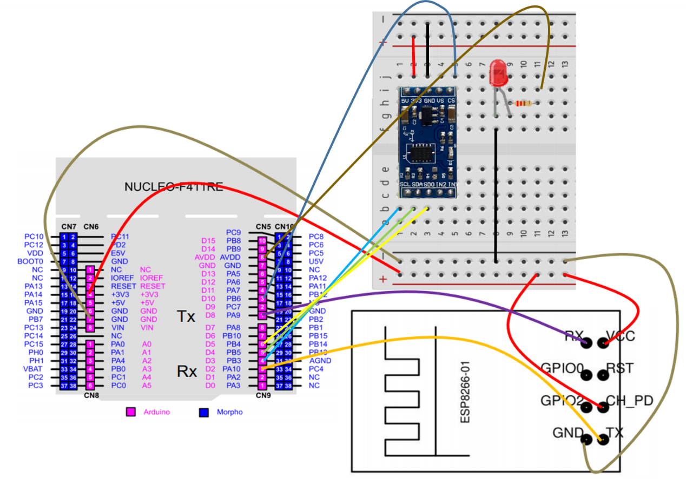

## 軟體程式執行流程圖

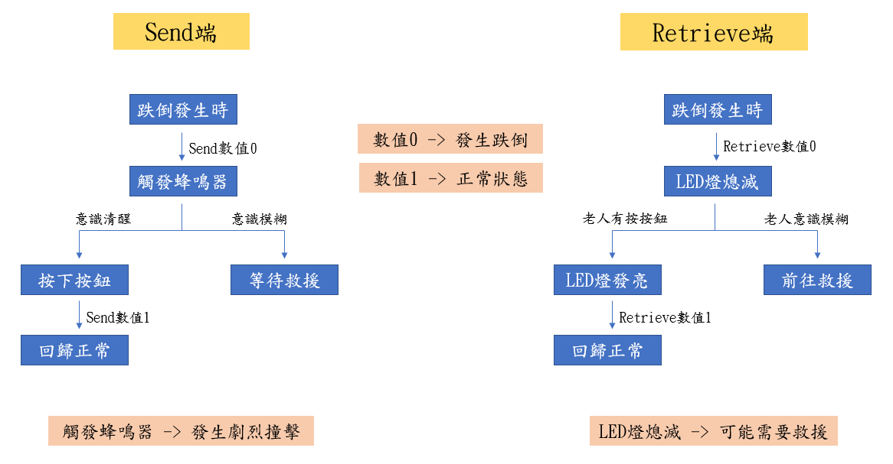
